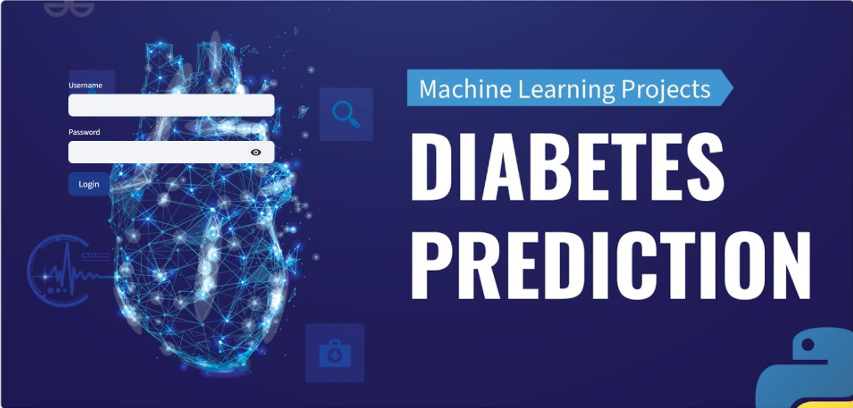
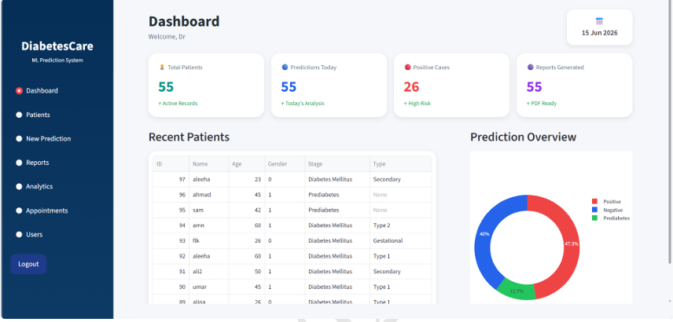
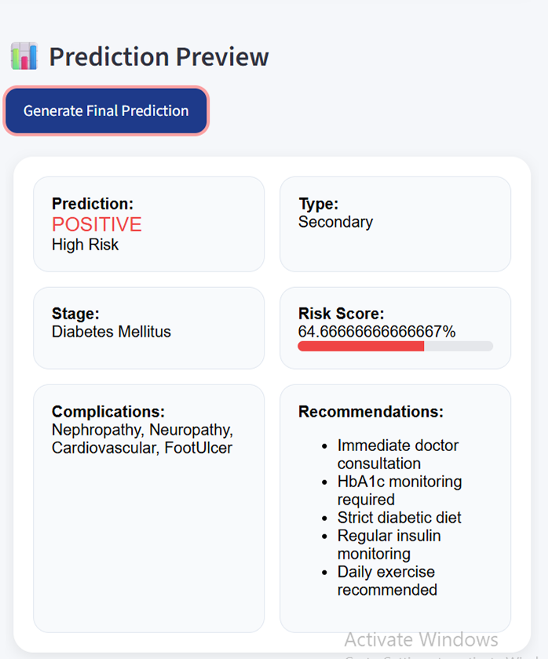
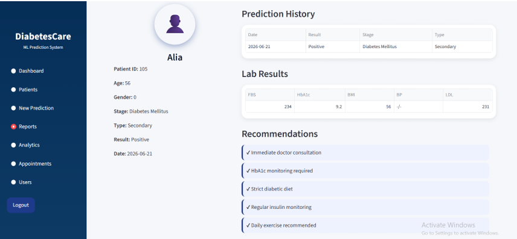
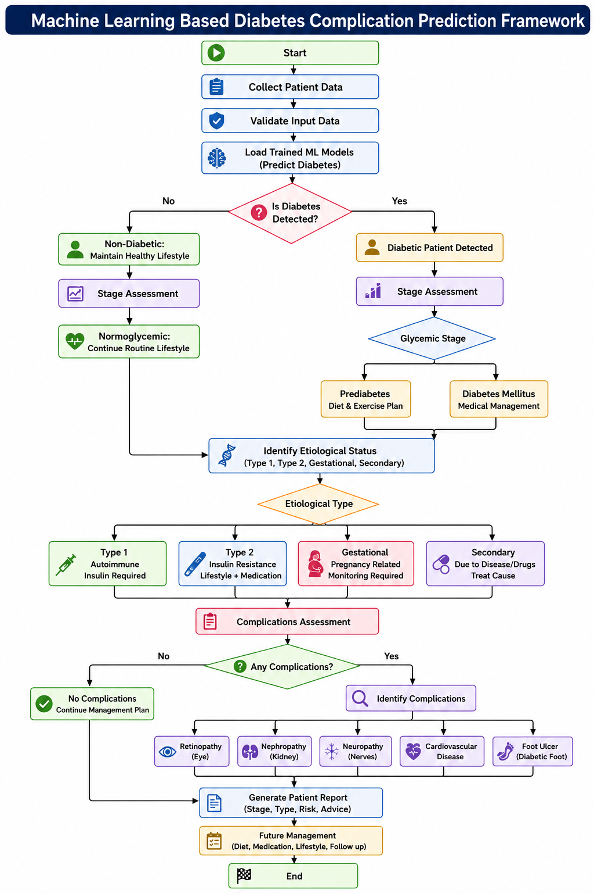

# Machine Learning Based Diabetes Complication Prediction Framework

<p align="center">
  
  
  
  
  
</p>

<p align="center">
  <strong>Final Year Project (FYP)</strong>
</p>

<p align="center">
  Machine Learning • Artificial Intelligence • Healthcare
</p>

---

## 📌 Project Overview

**Machine Learning Based Diabetes Complication Prediction Framework** is a Final Year Project focused on applying Machine Learning and Artificial Intelligence to a structured diabetes prediction and complication assessment workflow.

The framework processes patient information through multiple prediction stages, beginning with diabetes detection and stage assessment, followed by etiological type identification and complication assessment.

The system provides an interactive application for patient management, prediction results, analytics, reporting, and AI-assisted interaction.

---

## 🎯 Project Objectives

The major objectives of the project are:

- Develop a Machine Learning-based diabetes prediction framework.
- Detect whether diabetes is present based on patient information.
- Assess the diabetes stage.
- Identify the predicted etiological type of diabetes.
- Assess diabetes-related complications.
- Provide an interactive healthcare-oriented application.
- Maintain patient information and prediction records.
- Present prediction results through analytics and visualizations.
- Generate patient prediction reports.
- Integrate Artificial Intelligence for assisted interaction.

---

## ✨ Key Features

### 🩺 Diabetes Detection

The system collects and validates patient data before applying the trained Machine Learning models for diabetes prediction.

### 📊 Stage Assessment

The framework performs stage assessment for:

- Normoglycemic
- Prediabetes
- Diabetes Mellitus

### 🧬 Etiological Type Identification

For diabetic patients, the framework identifies the predicted etiological status and categorizes it into:

- Type 1
- Type 2
- Gestational
- Secondary

### ⚠️ Complication Assessment

The framework assesses diabetes-related complications, including:

- Retinopathy (Eye)
- Nephropathy (Kidney)
- Neuropathy (Nerves)
- Cardiovascular Disease
- Foot Ulcer (Diabetic Foot)

### 👤 Patient Management

The application provides functionality for managing patient information and prediction records.

### 📈 Analytics

The system provides analytical views and visualizations for interpreting prediction-related information.

### 📄 Patient Reports

The framework generates patient-oriented reports containing relevant prediction results and recommendations.

### 🤖 AI-Assisted Interaction

The application integrates the **Gemini API** to provide an AI-assisted interaction component.

---
## Screenshots

### Login Interface
The DiabetesCare login interface provides authenticated access to the prediction and management features of the system.



### Dashboard
The interactive dashboard provides an overview of patient records, prediction statistics, recent cases, and diabetes prediction results.



### ML Prediction Results
The prediction interface displays diabetes classification, risk score, disease stage, predicted complications, and generated recommendations.



### Prediction History & Reports
The reporting interface presents prediction history, laboratory results, diabetes classification, and generated recommendations.



## 📋 System Flowchart

The following flowchart represents the complete prediction and management workflow of the Final Year Project.



---

## 🧠 Machine Learning Models

The trained Machine Learning models used by the application are stored in the `models` directory.

```text
models/
├── step1.pkl
├── step2.pkl
└── step3.pkl
```

These models are integrated into the application's multi-stage prediction workflow.

---

## 🛠️ Technology Stack

| Category | Technologies |
|---|---|
| Programming Language | Python |
| Machine Learning | Scikit-learn |
| Data Processing | Pandas, NumPy |
| Model Serialization | Joblib |
| User Interface | Streamlit |
| Data Visualization | Plotly |
| Database | SQLite3 |
| AI Integration | Gemini API |
| Report Generation | ReportLab |
| Version Control | GitHub |

---

## 🏗️ System Components

The application consists of several major components:

```text
Authentication
     │
     ▼
Dashboard
     │
     ├── Patient Management
     │
     ├── New Prediction
     │       ├── Diabetes Detection
     │       ├── Stage Assessment
     │       ├── Etiological Type
     │       └── Complication Assessment
     │               ├── Retinopathy
     │               ├── Nephropathy
     │               ├── Neuropathy
     │               ├── Cardiovascular Disease
     │               └── Foot Ulcer
     │
     ├── Reports
     │
     ├── Analytics
     │
     └── AI-Assisted Interaction
```

---

## 📂 Project Structure

```text
Diabetes-Complication-Prediction/
│
├── ml.py
├── database.py
├── auth_db.py
├── requirements.txt
├── README.md
├── flowchart.png
│
└── models/
    ├── step1.pkl
    ├── step2.pkl
    └── step3.pkl
```

---

## 📊 Project Highlights

- Multi-stage Machine Learning prediction framework
- Diabetes detection
- Diabetes stage assessment
- Etiological type identification
- Diabetes complication assessment
- Retinopathy prediction
- Nephropathy prediction
- Neuropathy prediction
- Cardiovascular disease assessment
- Foot ulcer assessment
- Patient management
- Prediction history
- Analytics and data visualization
- Patient report generation
- AI-assisted interaction
- SQLite3 database integration
- Streamlit-based healthcare application

---

## 🎓 Final Year Project

**Project Title**

**Machine Learning Based Diabetes Complication Prediction Framework**

**Project Type**

Final Year Project (FYP)

**Domain**

Machine Learning | Artificial Intelligence | Healthcare

**Primary Technologies**

Python | Scikit-learn | Streamlit | SQLite3 | Gemini API

---

## 👩‍💻 Author

**Khizra**

GitHub:  
https://github.com/1khizra

---

<p align="center">
  <strong>Machine Learning • Artificial Intelligence • Healthcare Technology</strong>
</p>
                          ▼
                         End
